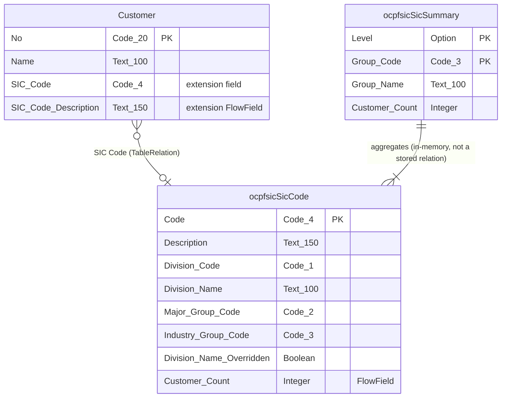

# SIC Code Classification — Documentation

**Version:** 1.0.1.1 · **Date:** 2026-09-27

## 1. Technical reference

### 1.1 Objects

| ID | Type | Name | Purpose |
|---|---|---|---|
| 77071 | Table | ocpfsicSicCode | Reference table holding the full OSHA SIC hierarchy (Division, Major Group, Industry Group, 4-digit Industry code + description), plus a computed Customer Count. |
| 77072 | Page (List) | ocpfsicSicCodes | Browse/search the SIC Code list; drill down to customers assigned a given code. |
| 77073 | Table Extension | ocpfsicCustomerExt | Adds `SIC Code` and `SIC Code Description` to Customer. |
| 77074 | Page Extension | ocpfsicCustomerCardExt | Surfaces the SIC classification on the Customer Card. |
| 77075 | Codeunit | ocpfsicSicCodeImport | Imports the bundled SIC code list; registers the Assisted Setup entry. |
| 77076 | Page (Assisted Setup) | ocpfsicSicCodeSetupWizard | Guides the first (and any later) SIC code import. |
| 77077 | PermissionSet | ocpfsicSicView (`OCPFSIC SIC, VIEW`) | Read access to SIC Code data and browsing/API pages. |
| 77078 | PermissionSet | ocpfsicSicEdit (`OCPFSIC SIC, EDIT`) | Full read/write access, plus the import wizard. |
| 77079 | Table (temporary) | ocpfsicSicSummary | In-memory buffer for the customer-count drill-down. |
| 77080 | Page (List) | ocpfsicSicSummary | Interactive customer-count drill-down by Division / Major Group / Industry Group. |
| 77081 | Page (API) | ocpfsicSicCodeApi | OData API for the SIC Code table. |
| 77082 | Page (API) | ocpfsicCustomerApi | OData API for Customer, including every applicable standard field plus SIC classification. |

### 1.2 Schema



*Rendered and verified with `@mermaid-js/mermaid-cli` before publishing (Step 6 exit gate).*

### 1.3 API reference

**Base URL shape** (Standards Appendix A):
`https://api.businesscentral.dynamics.com/v2.0/<environment>/api/onlyCopilotFans/ocpfsicClassification/v1.0/companies(<companyId>)/<entitySetName>`

#### 1.3.1 `ocpfsicSicCodes` (Page 77081, source table `ocpfsicSicCode`) — Read/Write

| Field | Type | R/W | Notes |
|---|---|---|---|
| `code` | Code[4] | RW | 4-digit SIC industry code. Primary key. |
| `description` | Text[150] | RW | Official industry description. |
| `divisionCode` | Code[1] | RW | SIC division letter, A–J. |
| `divisionName` | Text[100] | RW | Division name. |
| `majorGroupCode` | Code[2] | RW | 2-digit major group code. |
| `industryGroupCode` | Code[3] | RW | 3-digit industry group code. |
| `customerCount` | Integer | R (FlowField) | Number of customers assigned this code. |

Deleting a code that's assigned to any Customer is rejected (the table's `OnDelete` guard).

**Quick start**
```
GET  .../ocpfsicSicCodes?$top=5
GET  .../ocpfsicSicCodes(code='0111')
POST .../ocpfsicSicCodes   { "code": "9999", "description": "Test Industry" }
PATCH .../ocpfsicSicCodes(code='9999')   { "description": "Updated" }
DELETE .../ocpfsicSicCodes(code='9999')
```
`$filter=divisionCode eq 'D'`, `$select=code,description` both work as expected.

**Known limitation:** deleting a code in use returns a generic OData error surfacing the table's
block message — no dedicated error code.

#### 1.3.2 `ocpfsicCustomers` (Page 77082, source table `Customer`) — Read/Write

All 159 applicable standard `Customer` fields, plus `sicCode` and `sicCodeDescription`. This is a
**separate, self-contained entity** from Microsoft's own standard Customer API (`api/v2.0/.../customers`)
— not an extension of it. Field identifiers are the standard field names converted to camelCase
(Standards §4.1), e.g. `"No."` → `no`, `"Credit Limit (LCY)"` → `creditLimitLCY`. The full field
list, with each identifier's source field name, is `src/Pages/ocpfsicCustomerApi.Page.al` — 161
fields is too many to usefully re-list here; use `$metadata` to discover the live schema.

```
GET .../ocpfsicCustomers?$top=1
GET .../ocpfsicCustomers?$select=no,name,sicCode,sicCodeDescription&$filter=sicCode eq '0111'
PATCH .../ocpfsicCustomers(<SystemId>)   { "sicCode": "0111" }
```

**Known limitations:**
- 18 localization-specific Customer fields (field IDs 10,000–89,999, mostly Mexico-specific tax
  fields) are intentionally excluded (Standards §3.2 — this is a US/`W1` deployment).
- This page mirrors BC 28.0/28.5's Customer schema as of 2026-09-27. A later BC version that adds,
  renames, or obsoletes a Customer field won't automatically appear here (DesignDoc.md B3.11).
- Two entities now expose Customer data with different field-name conventions (this one, and
  Microsoft's standard API) — pick one per integration to avoid confusion.

### 1.4 Permission sets

| Permission Set | Grants |
|---|---|
| `OCPFSIC SIC, VIEW` (77077) | Read `ocpfsicSicCode`; execute `ocpfsicSicCodes`, `ocpfsicSicSummary`, `ocpfsicSicCodeApi`, `ocpfsicCustomerApi`. |
| `OCPFSIC SIC, EDIT` (77078) | Everything in VIEW, plus Read/Insert/Modify/Delete on `ocpfsicSicCode`, and execute on the import codeunit and setup wizard. |

Neither set grants `Customer` tabledata permissions directly — a user also needs a standard role
(e.g. any Sales/Customer role) that already grants Customer access, same as before this extension
existed.

### 1.5 Events, setup, upgrade notes

- **Events:** one subscription only — `Codeunit "Guided Experience".OnRegisterAssistedSetup`, to
  register the import wizard on BC's standard Assisted Setup page. Nothing is published.
- **Setup:** run the **Import SIC Codes** assisted setup (or re-run it any time — it's an upsert)
  before assigning SIC codes to customers.
- **Upgrade:** none needed yet — this is still pre-release (`app.json` `1.0.1.0`, no real tenant has
  installed a prior version). Revisit at the next version that changes what existing data must look
  like (DesignDoc.md B6).

## 2. User guide

For Business Central users maintaining Customer master data (sales, credit, or compliance staff).

### 2.1 Before you start

Run the **Import SIC Codes** assisted setup once (Business Manager role center → Assisted Setup, or
search for "Import SIC Codes"). This loads the ~1,005 official SIC codes so they're available to
assign.

### 2.2 Getting there

- **Assign a SIC code to a customer:** open the Customer Card → **SIC Classification** section.
- **Browse the SIC code list:** search for "SIC Codes".
- **See customer counts and drill down:** search for "SIC Code Summary", or use the **Customers**
  action on the SIC Codes list.

### 2.3 Tasks

**Assign a SIC code to a customer**
1. Open the customer's Customer Card.
2. In the **SIC Classification** section, set **SIC Code** (use the lookup to search by code or
   description).
3. **SIC Code Description** fills in automatically.

**Look up customers by SIC code**
1. Open **SIC Codes**.
2. Find the code (sort/filter by any column, including **Customer Count**).
3. Select the row, then choose the **Customers** action.

**Look up customers by Division, Major Group, or Industry Group**
1. Open **SIC Code Summary**.
2. Choose **By Division**, **By Major Group**, or **By Industry Group**.
3. Select a row, then choose the **Customers** action.

**Re-import or refresh the SIC code list**
1. Open **Import SIC Codes** (Assisted Setup) again.
2. Choose **Import**. Existing codes are updated, not duplicated; any Division Name you've
   manually corrected is preserved.

### 2.4 Messages you may see

| Message | Meaning | What to do |
|---|---|---|
| "You can't delete SIC Code X because it's assigned to at least one customer." | The SIC Code Import wizard or list tried to delete a code still in use. | Reassign or clear the SIC Code on every customer using it first, then delete. |
| "Import complete. N SIC codes are ready to assign to customers." | The import wizard finished. | Nothing — informational. |

## 3. Deployment

| Item | Value |
|---|---|
| Package (the one that passed Step 7) | `outputAppPackage/SIC_Code_Classification_1.0.1.1.app` — the exact build tested as `1.0.1.0` (Revision-only bump, no code change), marking it as the release candidate. |
| Schema Sync Mode | **Add**. This is the first real deployment — nothing removed, shrunk, retyped, or re-keyed since there's no prior production install. |
| Steps (Extension Management) | Business Central → Extension Management → Upload Extension → select the `.app` file from `outputAppPackage/` → Deploy → assign `OCPFSIC SIC, VIEW` and/or `OCPFSIC SIC, EDIT` to the relevant users. |
| After deploying | Assign permission sets; run the **Import SIC Codes** assisted setup once; smoke-test by assigning a SIC code to one customer and confirming the description appears immediately. |
| Rollback | Uninstall the extension via Extension Management. The `SIC Code` and `SIC Code Description` fields and the SIC Code table are removed with it; no other Customer data is affected. |

## Before calling this done

- [x] Every object in the register is in §1.1.
- [x] Every user task is in §2 with numbered steps.
- [x] §3 names the exact package that passed — `SIC_Code_Classification_1.0.1.1.app` (Step 7,
      2026-09-27).
